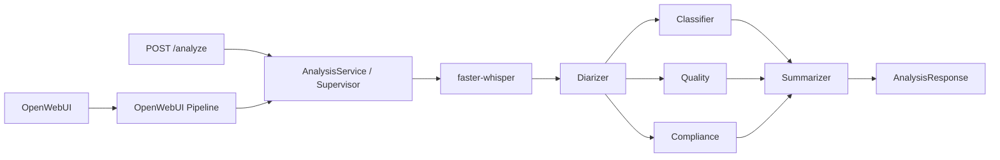
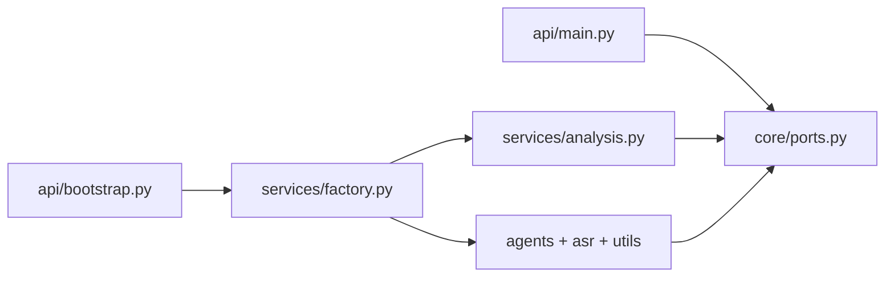

# MTBank Call Analytics

Прототип анализа звонков контакт-центра: `faster-whisper` создаёт
транскрипт, базовый diarizer назначает роли, а четыре LLM-агента формируют
классификацию, оценку качества, compliance-проверку и резюме.

## Архитектура



Используется собственный **Supervisor pattern**. Классификатор, агент
качества и compliance выполняются параллельно через `asyncio.gather`.
Суммаризатор запускается вторым этапом и получает их результаты через
оркестратор. Агенты не импортируют и не вызывают друг друга напрямую.

## Структура

- `pipeline.py` — обязательный OpenWebUI Pipeline и Markdown-ответ.
- `api/main.py` — HTTP-маршруты, зависящие только от абстракций.
- `api/bootstrap.py` — HTTP Composition Root, где подключаются реализации.
- `core/ports.py` — абстрактные классы (порты) приложения.
- `core/container.py` — контейнер абстрактных зависимостей для entry points.
- `services/analysis.py` — единый сценарий анализа для обоих входов.
- `services/factory.py` — Composition Root.
- `services/llm_client.py` — OpenAI-compatible LLM adapter.
- `agents/` — четыре независимых агента.
- `asr/` — ASR adapter и базовая диаризация.
- `models/` — Pydantic-контракты.
- `utils/` — JSON-логирование и работа с аудио.

## Куда писать реализацию

Зависимости направлены от реализаций к стабильным портам:



Правила размещения:

- Новый бизнес-сценарий или интерфейс сначала объявляется абстрактным классом
  в `core/ports.py`.
- Оркестрация шагов пишется в `services/analysis.py`; сетевого и файлового
  кода там быть не должно.
- Подключение конкретных классов выполняется только в `services/factory.py`.
- HTTP parsing, коды ответа и FastAPI-зависимости пишутся в `api/main.py`.
- Запуск FastAPI, конфигурация и создание реальных объектов — в
  `api/bootstrap.py`.
- Реализация нового LLM-провайдера пишется в `services/llm_client.py` либо
  отдельном адаптере рядом; класс реализует `StructuredLLMPort`.
- Реализация ASR пишется в `asr/transcriber.py` и реализует `TranscriberPort`.
- Реализация диаризации пишется в `asr/diarizer.py` и реализует
  `DiarizerPort`.
- Промпт и логика конкретного эксперта пишутся в соответствующем файле
  `agents/`; общий вызов LLM и логирование остаются в `agents/base.py`.
- Структуры входа/выхода добавляются в `models/schemas.py`, а не в API или
  агенты.
- Загрузка файлов и URL реализуется в `utils/audio.py` через
  `AudioStoragePort`.
- Общие технические утилиты без бизнес-решений размещаются в `utils/`.
- Подмена реализации в тесте делается классом-заглушкой соответствующего
  порта; FastAPI и Supervisor не нужно переписывать.

Все функции ограничены 15 строками. Ограничение автоматически проверяется в
`tests/test_architecture.py`.

## Локальный запуск

1. Скопируйте конфигурацию:

   ```bash
   cp .env.example .env
   ```

2. Запустите OpenAI-compatible LLM. Значения по умолчанию рассчитаны на
   Ollama с моделью `qwen2.5:7b`.

3. Поднимите стек:

   ```bash
   docker compose up --build
   ```

4. Откройте:
   - OpenWebUI: <http://localhost:3000>
   - Swagger API: <http://localhost:8000/docs>

Первый запуск скачивает Whisper `medium` и поэтому занимает больше времени.

## REST API

Загрузка файла:

```bash
curl -X POST http://localhost:8000/analyze \
  -F "file=@test_data/call.wav"
```

Анализ URL:

```bash
curl -X POST http://localhost:8000/analyze \
  -H "Content-Type: application/json" \
  -d '{"url":"https://example.org/call.mp3"}'
```

## Тесты

```bash
pytest
```

В тестах Whisper и LLM заменяются заглушками: проверяется оркестрация и
валидация контрактов без загрузки моделей и сетевых запросов.

## Текущие ограничения

- `Diarizer` — детерминированный baseline с чередованием сегментов. Для
  production его следует заменить на speaker embeddings/`pyannote.audio`.
- Список compliance-правил пока задаётся промптом; в production правила
  должны версионироваться отдельно.
- Перед публичным деплоем загрузку URL нужно ограничить allowlist доменов,
  чтобы исключить SSRF.
- Тестовые аудио, эталонные транскрипты и WER-таблица ещё должны быть
  подготовлены согласно `README_task.md`.
