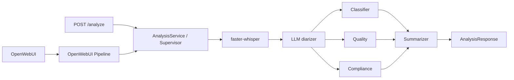
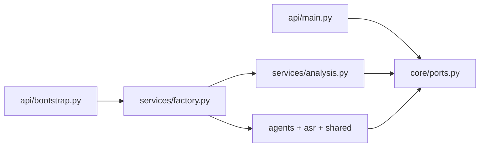

# MTBank Call Analytics

Прототип для [тестового задания AI Engineer](README_task.md): система
анализирует русскоязычные звонки контакт-центра. `faster-whisper` создаёт
транскрипт с таймкодами, LLM-диаризация назначает роли, а четыре независимых
LLM-агента формируют классификацию, оценку качества, compliance-проверку и
резюме.

Сценарий доступен через OpenWebUI Pipeline и REST API `POST /analyze`; оба
входа используют один `AnalysisService` и возвращают одинаковый набор данных.

## Архитектура



Используется собственный **Supervisor pattern** вместо LangGraph: граф
процесса фиксированный, линейный и не требует ветвления или сохранения
состояния между вызовами. Классификатор, агент качества и compliance
выполняются параллельно через `asyncio.gather`; суммаризатор запускается
вторым этапом и получает их результаты через оркестратор. Агенты не
импортируют и не вызывают друг друга напрямую, поэтому их проще тестировать и
заменять.

LLM подключается через OpenAI-compatible API и требует структурированный JSON,
проверяемый Pydantic-моделями. По умолчанию конфигурация рассчитана на локальный
Ollama; можно использовать любую совместимую модель, способную стабильно
следовать JSON Schema. В примерах используется `llama3.2`, а `qwen2.5:7b`
подходит как альтернативный более сильный вариант для русскоязычных диалогов.

## Структура

- `pipeline.py` — обязательный OpenWebUI Pipeline и Markdown-ответ.
- `api/main.py` — HTTP-маршруты, зависящие только от абстракций.
- `api/bootstrap.py` — HTTP Composition Root, где подключаются реализации.
- `core/ports.py` — абстрактные классы (порты) приложения.
- `core/container.py` — контейнер абстрактных зависимостей для entry points.
- `services/analysis.py` — единый сценарий анализа для обоих входов.
- `services/factory.py` — Composition Root.
- `services/llm_client.py` — OpenAI-compatible LLM adapter.
- `agents/` — четыре независимых агента.
- `asr/` — ASR adapter и базовая диаризация.
- `models/` — Pydantic-контракты.
- `shared/` — JSON-логирование и работа с аудио (не `utils/`: конфликт с OpenWebUI).

## Куда писать реализацию

Зависимости направлены от реализаций к стабильным портам:



Правила размещения:

- Новый бизнес-сценарий или интерфейс сначала объявляется абстрактным классом
  в `core/ports.py`.
- Оркестрация шагов пишется в `services/analysis.py`; сетевого и файлового
  кода там быть не должно.
- Подключение конкретных классов выполняется только в `services/factory.py`.
- HTTP parsing, коды ответа и FastAPI-зависимости пишутся в `api/main.py`.
- Запуск FastAPI, конфигурация и создание реальных объектов — в
  `api/bootstrap.py`.
- Реализация нового LLM-провайдера пишется в `services/llm_client.py` либо
  отдельном адаптере рядом; класс реализует `StructuredLLMPort`.
- Реализация ASR пишется в `asr/transcriber.py` и реализует `TranscriberPort`.
- Реализация диаризации пишется в `asr/diarizer.py` и реализует
  `DiarizerPort`.
- Промпт и логика конкретного эксперта пишутся в соответствующем файле
  `agents/`; общий вызов LLM и логирование остаются в `agents/base.py`.
- Структуры входа/выхода добавляются в `models/schemas.py`, а не в API или
  агенты.
- Загрузка файлов и URL реализуется в `shared/audio.py` через
  `AudioStoragePort`.
- Общие технические утилиты без бизнес-решений размещаются в `shared/`.
- Подмена реализации в тесте делается классом-заглушкой соответствующего
  порта; FastAPI и Supervisor не нужно переписывать.

Все функции ограничены 15 строками. Ограничение автоматически проверяется в
`tests/test_architecture.py`.

## Требования и конфигурация

- Python 3.11+;
- LLM с OpenAI-compatible API (для локального запуска — [Ollama](https://ollama.com));
- `ffmpeg` для обработки аудио; в Docker-образах он устанавливается автоматически;
- Docker Desktop — только для полного стека.

Создайте `.env` из примера:

```bash
cp .env.example .env
```

| Переменная | Назначение |
|---|---|
| `LLM_BASE_URL`, `LLM_API_KEY`, `LLM_MODEL` | Подключение к LLM |
| `WHISPER_MODEL`, `WHISPER_DEVICE`, `WHISPER_COMPUTE_TYPE` | Конфигурация ASR |
| `MAX_AUDIO_BYTES` | Максимальный размер входного файла, по умолчанию 50 MiB |
| `LOG_LEVEL` | Уровень JSON-логирования |

`tiny` в `.env.example` и Docker Compose предназначен для быстрого локального
старта. Для соответствия ТЗ задайте `WHISPER_MODEL=medium` или более крупную
модель. Для запуска контейнеров с Ollama на хосте используйте
`LLM_BASE_URL=http://host.docker.internal:11434/v1`.

## Запуск

### Вариант A — только API (быстро, без Docker)

Нужны: Python 3.11+, [Ollama](https://ollama.com) с любой chat-моделью.

```bash
cp .env.example .env
# в .env для запуска на хосте:
#   LLM_BASE_URL=http://127.0.0.1:11434/v1
#   LLM_MODEL=llama3.2          # или ваша модель из `ollama list`
#   WHISPER_MODEL=tiny          # для быстрого старта; для сдачи — medium

python3 -m venv .venv
source .venv/bin/activate
pip install -r requirements.txt

# если HuggingFace недоступен через системный proxy — снимите proxy на время старта
uvicorn api.bootstrap:app --host 127.0.0.1 --port 8000
```

Откройте Swagger: <http://127.0.0.1:8000/docs>  
Проверка: `curl http://127.0.0.1:8000/health` → `{"status":"ok"}`

### Вариант B — полный стек (OpenWebUI + Pipelines + API)

1. Запустите **Docker Desktop** (иначе `docker compose` упадёт с ошибкой socket).
2. В `.env` для контейнеров верните:

   ```bash
   LLM_BASE_URL=http://host.docker.internal:11434/v1
   LLM_MODEL=llama3.2   # модель должна быть в Ollama на хосте
   WHISPER_MODEL=medium # требование ТЗ
   ```

3. Поднимите стек:

   ```bash
   docker compose up --build
   ```

4. Откройте:
   - OpenWebUI: <http://localhost:3000>
   - Swagger API: <http://localhost:8000/docs>

Первый запуск скачивает Whisper и образы — это может занять много времени.

## REST API

| Метод | Путь | Описание |
|---|---|---|
| `GET` | `/health` | Проверка доступности API |
| `POST` | `/analyze` | Транскрибация и полный анализ звонка |

Загрузка файла:

```bash
curl -X POST http://localhost:8000/analyze \
  -F "file=@test_data/call.wav"
```

Анализ URL:

```bash
curl -X POST http://localhost:8000/analyze \
  -H "Content-Type: application/json" \
  -d '{"url":"https://example.org/call.mp3"}'
```

Поддерживаются WAV, MP3 и OGG. Для `multipart/form-data` передайте поле `file`
либо `url`; для JSON доступно только поле `url`. Невалидный формат, размер
файла, URL или пустой транскрипт возвращают `422` с полем `detail`.

Ответ соответствует `AnalysisResponse`:

```json
{
  "transcript": [{"speaker": "Оператор", "start": 0.0, "end": 4.2, "text": "..."}],
  "classification": {"topic": "кредиты", "priority": "medium"},
  "quality_score": {"total": 78, "checklist": {"greeting": true, "need_detection": true, "solution_provided": true, "farewell": false}, "comment": "..."},
  "compliance": {"passed": true, "issues": []},
  "summary": "...",
  "action_items": ["..."]
}
```

## OpenWebUI Pipeline

После `docker compose up --build` откройте <http://localhost:3000>, выберите
**MTBank Call Analytics** и загрузите WAV/MP3/OGG в чат либо отправьте прямой
URL на файл. Pipeline получает вложение из хранилища OpenWebUI, запускает тот же
сценарий анализа, что и API, и возвращает Markdown-отчёт с темой, приоритетом,
оценкой качества, резюме, compliance и транскриптом.

## Тесты

```bash
PYTHONPATH=. pytest
```

В тестах Whisper и LLM заменяются заглушками: проверяются четыре агента,
LLM-диаризация, Supervisor end-to-end и валидация контрактов без загрузки
моделей и сетевых запросов. `tests/test_architecture.py` дополнительно
проверяет направление зависимостей и ограничение размера функций.

## Тестовые данные и качество ASR

В репозитории сейчас есть два демонстрационных аудиофайла:
`test_data/call_sample.mp3` и `test_data/sample_dialog.mp3`. До сдачи работы
набор следует расширить в соответствии с ТЗ: не менее пяти русскоязычных файлов
общей длительностью от пяти минут, включая телефонное качество 8 kHz и диалог
двух участников длительностью от минуты. Для каждого файла нужен эталонный
транскрипт и таблица WER, рассчитанная, например, через `jiwer`.

## Демо

URL публичного HTTPS-демо будет добавлен после развёртывания. Локальная
демонстрация доступна через Docker Compose и OpenWebUI.

## Текущие ограничения

- `Diarizer` назначает роли через LLM с эвристиками по ключевым фразам. Это не
  полноценная speaker diarization: для production следует использовать
  speaker embeddings или `pyannote.audio`.
- Список compliance-правил пока задаётся промптом; в production правила
  должны версионироваться отдельно.
- Перед публичным деплоем загрузку URL нужно ограничить allowlist доменов,
  чтобы исключить SSRF.
- CPU с `int8` выбран как переносимый дефолт, но может быть медленным на
  длинных записях; для production нужен GPU-профиль и нагрузочное тестирование.
