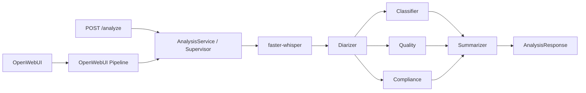

# MTBank Call Analytics

Прототип анализа звонков контакт-центра: `faster-whisper` создаёт
транскрипт, базовый diarizer назначает роли, а четыре LLM-агента формируют
классификацию, оценку качества, compliance-проверку и резюме.

## Архитектура



Используется собственный **Supervisor pattern**. Классификатор, агент
качества и compliance выполняются параллельно через `asyncio.gather`.
Суммаризатор запускается вторым этапом и получает их результаты через
оркестратор. Агенты не импортируют и не вызывают друг друга напрямую.

## Структура

- `pipeline.py` — обязательный OpenWebUI Pipeline и Markdown-ответ.
- `api/main.py` — REST API, принимающий файл или URL.
- `services/analysis.py` — единый сценарий анализа для обоих входов.
- `services/factory.py` — Composition Root.
- `services/llm_client.py` — OpenAI-compatible LLM adapter.
- `agents/` — четыре независимых агента.
- `asr/` — ASR adapter и базовая диаризация.
- `models/` — Pydantic-контракты.
- `utils/` — JSON-логирование и работа с аудио.

## Локальный запуск

1. Скопируйте конфигурацию:

   ```bash
   cp .env.example .env
   ```

2. Запустите OpenAI-compatible LLM. Значения по умолчанию рассчитаны на
   Ollama с моделью `qwen2.5:7b`.

3. Поднимите стек:

   ```bash
   docker compose up --build
   ```

4. Откройте:
   - OpenWebUI: <http://localhost:3000>
   - Swagger API: <http://localhost:8000/docs>

Первый запуск скачивает Whisper `medium` и поэтому занимает больше времени.

## REST API

Загрузка файла:

```bash
curl -X POST http://localhost:8000/analyze \
  -F "file=@test_data/call.wav"
```

Анализ URL:

```bash
curl -X POST http://localhost:8000/analyze \
  -H "Content-Type: application/json" \
  -d '{"url":"https://example.org/call.mp3"}'
```

## Тесты

```bash
pytest
```

В тестах Whisper и LLM заменяются заглушками: проверяется оркестрация и
валидация контрактов без загрузки моделей и сетевых запросов.

## Текущие ограничения

- `Diarizer` — детерминированный baseline с чередованием сегментов. Для
  production его следует заменить на speaker embeddings/`pyannote.audio`.
- Список compliance-правил пока задаётся промптом; в production правила
  должны версионироваться отдельно.
- Перед публичным деплоем загрузку URL нужно ограничить allowlist доменов,
  чтобы исключить SSRF.
- Тестовые аудио, эталонные транскрипты и WER-таблица ещё должны быть
  подготовлены согласно `README_task.md`.
