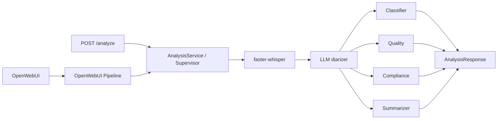
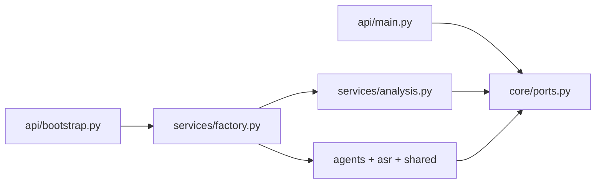

# MTBank Call Analytics

Прототип для [тестового задания AI Engineer](README_task.md): система
анализирует русскоязычные звонки контакт-центра. `faster-whisper` создаёт
транскрипт с таймкодами, LLM-диаризация назначает роли, а четыре независимых
LLM-агента формируют классификацию, оценку качества, compliance-проверку и
резюме.

Сценарий доступен через OpenWebUI Pipeline и REST API `POST /analyze`; оба
входа используют один `AnalysisService` и возвращают одинаковый набор данных.

## Архитектура



### Обоснование выбора архитектуры

Используется собственный **Supervisor pattern** вместо LangGraph:

- **Граф процесса фиксированный и линейный** — нет ветвления или условных переходов между агентами. LangGraph избыточен для такой задачи.
- **Параллельное выполнение** — классификатор, агент качества и compliance выполняются параллельно с суммаризатором через `asyncio.gather`. Суммаризатор получает только транскрипт и не зависит от результатов других агентов.
- **Простота тестирования** — агенты не импортируют и не вызывают друг друга напрямую, поэтому их проще тестировать и заменять.
- **Следование SRP** — каждый агент имеет одну ответственность, а оркестрация вынесена в отдельный сервис.

### Dependency Direction

Зависимости направлены от реализаций к стабильным портам:



## Структура проекта

```
mtbank-ai-hiring/
├── pipeline.py                # OpenWebUI Pipeline
├── settings.py                # Pydantic Settings
├── agents/
│   ├── base.py                # Template Method для агентов
│   ├── classifier.py          # Классификатор тематики
│   ├── quality.py             # Оценка качества обслуживания
│   ├── compliance.py          # Проверка compliance
│   ├── summarizer.py          # Суммаризация звонка
│   └── validation.py          # Валидация ответов LLM
├── asr/
│   ├── transcriber.py         # faster-whisper обёртка
│   └── diarizer.py            # LLM-диаризация
├── api/
│   ├── main.py                # FastAPI маршруты
│   └── bootstrap.py           # Composition Root
├── core/
│   ├── ports.py               # Абстрактные классы (порты)
│   └── container.py           # Контейнер зависимостей
├── services/
│   ├── analysis.py            # Supervisor оркестрация
│   ├── factory.py             # Composition Root
│   └── llm_client.py          # OpenAI-compatible клиент
├── models/
│   └── schemas.py             # Pydantic-контракты
├── shared/
│   ├── logging.py             # JSON-логирование
│   └── audio.py               # Загрузка и обработка аудио
├── tests/
│   ├── test_agents.py         # Unit-тесты агентов
│   ├── test_pipeline.py       # Интеграционные тесты
│   └── test_architecture.py   # Проверка архитектурных ограничений
├── test_data/                 # Тестовые аудио и транскрипты
├── docs/                      # Сценарии диалогов
├── docker-compose.yml
├── Dockerfile
├── Dockerfile.pipelines
├── .env.example
└── requirements.txt
```

### Правила размещения кода

- Новый бизнес-сценарий или интерфейс сначала объявляется абстрактным классом в `core/ports.py`.
- Оркестрация шагов пишется в `services/analysis.py`; сетевого и файлового кода там быть не должно.
- Подключение конкретных классов выполняется только в `services/factory.py`.
- HTTP parsing, коды ответа и FastAPI-зависимости пишутся в `api/main.py`.
- Запуск FastAPI, конфигурация и создание реальных объектов — в `api/bootstrap.py`.
- Реализация нового LLM-провайдера пишется в `services/llm_client.py` или отдельном адаптере рядом; класс реализует `StructuredLLMPort`.
- Реализация ASR пишется в `asr/transcriber.py` и реализует `TranscriberPort`.
- Реализация диаризации пишется в `asr/diarizer.py` и реализует `DiarizerPort`.
- Промпт и логика конкретного эксперта пишутся в соответствующем файле `agents/`; общий вызов LLM и логирование остаются в `agents/base.py`.
- Структуры входа/выхода добавляются в `models/schemas.py`, а не в API или агенты.
- Загрузка файлов и URL реализуется в `shared/audio.py` через `AudioStoragePort`.
- Общие технические утилиты без бизнес-решений размещаются в `shared/`.
- Подмена реализации в тесте делается классом-заглушкой соответствующего порта; FastAPI и Supervisor не нужно переписывать.

Все функции ограничены 15 строками. Ограничение автоматически проверяется в `tests/test_architecture.py`.

## Требования и конфигурация

- Python 3.11+;
- LLM с OpenAI-compatible API (для локального запуска — [Ollama](https://ollama.com));
- `ffmpeg` для обработки аудио; в Docker-образах он устанавливается автоматически;
- Docker Desktop — только для полного стека.

### Переменные окружения

Создайте `.env` из примера:

```bash
cp .env.example .env
```

| Переменная | Назначение |
|---|---|
| `DIARIZER_LLM_*` | Модель диаризации (кто говорит) |
| `CLASSIFIER_LLM_*` | Модель классификации разговора |
| `QUALITY_LLM_*` | Модель оценки качества |
| `COMPLIANCE_LLM_*` | Модель compliance-проверки |
| `SUMMARIZER_LLM_*` | Модель итогового резюме |
| `WHISPER_MODEL`, `WHISPER_DEVICE`, `WHISPER_COMPUTE_TYPE` | Конфигурация ASR |
| `MAX_AUDIO_BYTES` | Максимальный размер входного файла, по умолчанию 50 MiB |
| `LOG_LEVEL` | Уровень JSON-логирования |

Для каждой задачи задаётся свой набор `*_LLM_BASE_URL`, `*_LLM_API_KEY`,
`*_LLM_MODEL`. Общей модели нет. `tiny` в `.env.example` и Docker Compose
предназначен для быстрого локального старта. Для соответствия ТЗ задайте
`WHISPER_MODEL=medium` или более крупную модель. Для запуска контейнеров с
Ollama на хосте используйте `*_LLM_BASE_URL=http://host.docker.internal:11434/v1`.

## Запуск

### Вариант A — только API (быстро, без Docker)

Нужны: Python 3.11+, [Ollama](https://ollama.com) с любой chat-моделью.

```bash
cp .env.example .env
# в .env для запуска (для каждой задачи свой набор):
#   DIARIZER_LLM_BASE_URL=http://127.0.0.1:11434/v1
#   DIARIZER_LLM_API_KEY=ollama
#   DIARIZER_LLM_MODEL=llama3.2
#   ... то же для CLASSIFIER/QUALITY/COMPLIANCE/SUMMARIZER
#   WHISPER_MODEL=tiny            # для быстрого старта

python3 -m venv .venv
source .venv/bin/activate
pip install -r requirements.txt

uvicorn api.bootstrap:app --host 127.0.0.1 --port 8000
```

Откройте Swagger: <http://127.0.0.1:8000/docs>  
Проверка: `curl http://127.0.0.1:8000/health` → `{"status":"ok"}`

### Вариант B — полный стек (OpenWebUI + Pipelines + API)

1. Запустите **Docker Desktop** (иначе `docker compose` упадёт с ошибкой socket).
2. В `.env` для контейнеров верните:

   ```bash
   DIARIZER_LLM_BASE_URL=http://host.docker.internal:11434/v1
   DIARIZER_LLM_API_KEY=ollama
   DIARIZER_LLM_MODEL=llama3.2
   ... то же для CLASSIFIER/QUALITY/COMPLIANCE/SUMMARIZER
   WHISPER_MODEL=tiny            # для быстрого старта
   ```

3. Поднимите стек:

   ```bash
   docker compose up --build
   ```

4. Откройте:
   - OpenWebUI: <http://localhost:3000>
   - Swagger API: <http://localhost:8000/docs>

Первый запуск скачивает Whisper и образы — это может занять много времени.

## REST API

| Метод | Путь | Описание |
|---|---|---|
| `GET` | `/health` | Проверка доступности API |
| `POST` | `/analyze` | Транскрибация и полный анализ звонка |

### Загрузка файла

```bash
curl -X POST http://localhost:8000/analyze \
  -F "file=@test_data/dialog-transfers.mp3"
```

### Анализ URL

```bash
curl -X POST http://localhost:8000/analyze \
  -H "Content-Type: application/json" \
  -d '{"url":"https://example.org/call.mp3"}'
```

### Формат ответа

```json
{
  "transcript": [
    {"speaker": "Оператор", "start": 0.0, "end": 4.2, "text": "..."}
    {"speaker": "Клиент", "start": 4.2, "end": 8.5, "text": "..."}
  ],
  "classification": {"topic": "переводы", "priority": "medium"},
  "quality_score": {
    "total": 75,
    "checklist": {
      "greeting": true,
      "need_detection": true,
      "solution_provided": true,
      "farewell": false
    },
    "comment": "..."
  },
  "compliance": {"passed": true, "issues": []},
  "summary": "Клиент обратился по вопросу перевода...",
  "action_items": ["Отправить инструкцию на email"]
}
```

## OpenWebUI Pipeline

После `docker compose up --build` откройте <http://localhost:3000>, выберите
**MTBank Call Analytics** и загрузите WAV/MP3/OGG в чат либо отправьте прямой
URL на файл. Конфиг LLM/ASR берётся из `.env` (через `Settings`), не из Valves
в UI. Pipeline запускает тот же сценарий анализа, что и API, и возвращает
Markdown-отчёт с темой, приоритетом, оценкой качества, резюме, compliance и
транскриптом.

## Тесты

```bash
PYTHONPATH=. pytest
```

### Что проверяется

- **Unit-тесты агентов** (`test_agents.py`) — каждый агент проверяется отдельно с моком LLM.
- **Интеграционные тесты** (`test_pipeline.py`) — полный сценарий анализа от аудио до ответа.
- **Архитектурные ограничения** (`test_architecture.py`) — направление зависимостей и ограничение размера функций (15 строк).

В тестах Whisper и LLM заменяются заглушками: проверяются четыре агента,
LLM-диаризация, Supervisor end-to-end и валидация контрактов без загрузки
моделей и сетевых запросов.

## Тестовые данные

### Доступные файлы

| Файл | Формат | Качество | Описание |
|---|---|---|---|
| `dialog-transfers.mp3` | MP3 | 24kHz | Диалог: переводы (~1 мин) |
| `dialog-transfers-tel.mp3` | MP3 | 8 kHz | Телефонное качество |
| `dialog-complaints.mp3` | MP3 | 24kHz | Диалог: жалобы (~1 мин) |
| `dialog-complaints-tel.mp3` | MP3 | 8 kHz | Телефонное качество |
| `dialog-cards.mp3` | MP3 | 24kHz | Диалог: карты (~1 мин) |
| `dialog-cards-tel.mp3` | MP3 | 8 kHz | Телефонное качество |
| `dialog-incompetent.mp3` | MP3 | 24kHz | Диалог: некомпетентный оператор (~1 мин) |
| `dialog-incompetent-tel.mp3` | MP3 | 8 kHz | Телефонное качество |
| `sample_dialog.mp3` | MP3 | 24kHz | Диалог: кредит (~2 мин) |
| `sample_dialog.ogg` | ODD | 24kHz | Диалог: кредит (~2 мин) |
| `Zvonok_v_Privat_Bank_*.mp3` | MP3 | 44.1kHz | Реальный звонок в банк |
| `Zvonok_v_bank_*.wav` | WAV | 8kHz | Диалог: другое (~2 мин) |

> Файл `Zvonok_v_Privat_Bank_*.mp3` скачен с сайта [SkySound](https://xn-----8kcdcb6azafxgeb.skysound7.com) и конвертирован в `.wav` формат и в `8 kHz` на сайте [CloudConvert](https://cloudconvert.com/mp3-to-wav).
> Все остальные файлы были сгенерированы по аналогии с `sample_dialog.mp3`.
> Конвертация `dialog-*.mp3` файлов в 8kHz была получена с помощью кода `scripts/generate_dialogs.py`.
> Для конвертирования в `.ogg` формат использовался сайт [FreeConvert](https://www.freeconvert.com/mp3-to-ogg)

### Требования ТЗ

- Минимум 5 аудиофайлов (11 файлов)
- Хотя бы один файл 8 kHz (5 файлов)
- Диалог двух говорящих длительностью 1+ минута
- Общая длительность не менее 5 минут
- Эталонные транскрипты — в `docs/sample-dialog-*.md` (скрипт `scripts/calculate_wer.py` извлекает оттуда)
- WER-таблица — см. ниже

## Качество ASR (WER)

| Файл | Модель | WER |
|---|---|---|
| dialog-incompetent.mp3 | medium | 4.3% |
| dialog-transfers.mp3 | medium | 12.5% |
| dialog-cards.mp3 | medium | 13.3% |
| dialog-complaints.mp3 | medium | 28.7% |
| **Среднее** | | **14.7%** |

> Рассчитано через `jiwer` после прогона `faster-whisper` (medium, CPU int8) против эталонных текстов из `docs/sample-dialog-*.md`.
> Скрипт расчёта: `scripts/calculate_wer.py`.

## Демо

URL публичного HTTPS-демо будет добавлен после развёртывания. Локальная
демонстрация доступна через Docker Compose и OpenWebUI.

## Текущие ограничения

- `Diarizer` сначала независимо строит LLM- и эвристическую разметки, затем
  вторым LLM-вызовом сверяет их и назначает итоговые роли. Это не полноценная
  speaker diarization: для production следует использовать speaker embeddings
  или `pyannote.audio`.
- Список compliance-правил пока задаётся промптом; в production правила
  должны версионироваться отдельно.
- Перед публичным деплоем загрузку URL нужно ограничить allowlist доменов,
  чтобы исключить SSRF.
- CPU с `int8` выбран как переносимый дефолт, но может быть медленным на
  длинных записях; для production нужен GPU-профиль и нагрузочное тестирование.
