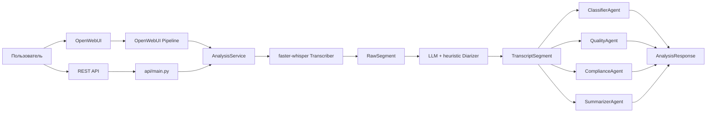
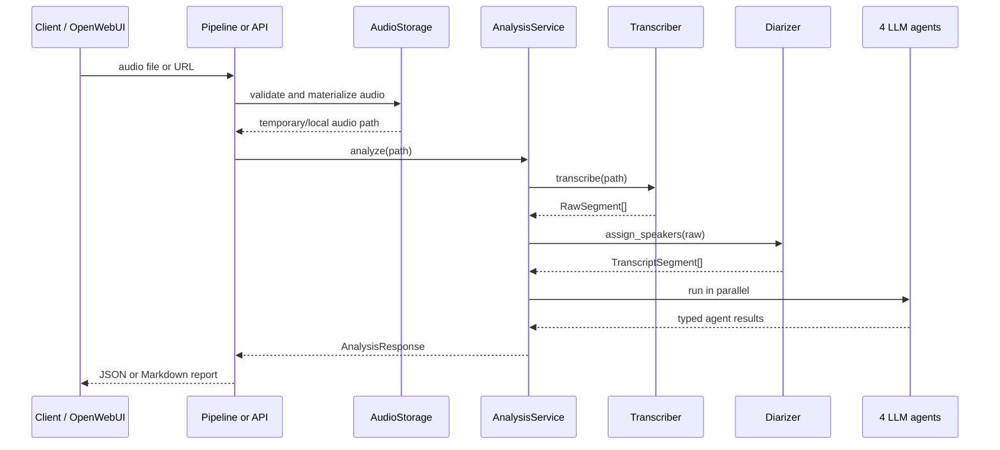
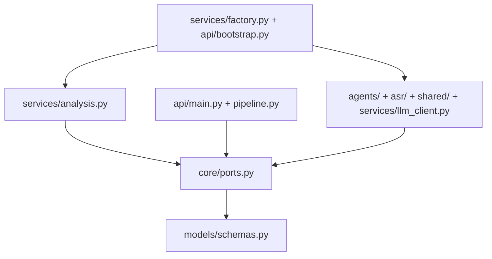

# MTBank Call Analytics

Архитектурный прототип для [тестового задания AI Engineer](README_task.md):
система принимает запись русскоязычного звонка контакт-центра, строит
транскрипт, назначает роли `Оператор` / `Клиент` и запускает четыре независимых
LLM-агента для аналитики качества обслуживания.

Проект намеренно сделан не как один большой pipeline-скрипт, а как небольшое
приложение с портами, адаптерами и единым application use case. Поэтому
OpenWebUI Pipeline и REST API используют один и тот же сценарий анализа и
возвращают согласованные данные.

## Возможности

- Приём аудио через OpenWebUI чат: загрузка WAV/MP3/OGG или прямая ссылка на
  аудиофайл.
- REST API `POST /analyze` с `multipart/form-data` и JSON `{ "url": "..." }`.
- ASR на `faster-whisper` с таймкодами сегментов.
- Ролевая диаризация `Оператор` / `Клиент`: LLM-разметка сверяется с
  эвристической разметкой по банковским репликам.
- Четыре специализированных агента:
  - классификатор темы и приоритета;
  - агент качества по чеклисту оператора;
  - compliance-проверка;
  - суммаризатор с action items.
- OpenAI-compatible LLM-клиент для Ollama, OpenAI-compatible gateway или другой
  совместимой модели.
- Раздельная конфигурация LLM для каждой задачи: диаризация, классификация,
  качество, compliance и суммаризация могут работать на разных моделях.
- Pydantic-контракты для всех ответов агентов и итогового API-ответа.
- JSON-логи входа/выхода агентов и lifecycle-событий анализа.
- Docker Compose для полного стека: OpenWebUI, Pipelines и FastAPI.
- Pytest-набор: unit-тесты агентов, интеграционные тесты pipeline и
  архитектурные guardrails.

## Архитектура



Главный центр системы — `AnalysisService`. Он ничего не знает о FastAPI,
OpenWebUI, HTTP-загрузках, Whisper-классах или конкретном LLM SDK. Сервис
работает только с абстракциями из `core/ports.py`:

- `TranscriberPort`;
- `DiarizerPort`;
- `ClassifierPort`;
- `QualityPort`;
- `CompliancePort`;
- `SummarizerPort`;
- `AudioStoragePort`;
- `StructuredLLMPort`.

Конкретные реализации собираются в `services/factory.py`, а FastAPI-приложение
получает готовый контейнер через `api/bootstrap.py`. Это делает `factory` и
`bootstrap` composition root проекта: здесь разрешено знать о реальных классах,
моделях и настройках.

## Поток данных



Порядок шагов фиксированный:

1. Входной слой получает аудио и превращает его во временный файл.
2. `Transcriber` строит ASR-сегменты с `start`, `end`, `text`.
3. `Diarizer` назначает каждому сегменту роль.
4. Четыре агента параллельно анализируют один и тот же транскрипт через
   `asyncio.gather`.
5. `AnalysisService` собирает единый `AnalysisResponse`.

## Почему Supervisor Pattern

В README_task.md разрешены LangGraph или собственный Supervisor-паттерн. Здесь
выбран Supervisor, потому что граф процесса простой и заранее известный:
транскрибация, диаризация, затем четыре независимые аналитические ветки.

Такой выбор выделяется несколькими свойствами:

- Меньше инфраструктурного шума. Для линейного workflow без условных переходов
  LangGraph добавил бы зависимость и слой абстракции, но не дал бы ощутимой
  пользы.
- Ясное разделение ответственности. `AnalysisService` координирует сценарий,
  агенты принимают только транскрипт и возвращают typed result, ASR занимается
  только речью.
- Хорошая тестируемость. Каждый порт легко заменить заглушкой, поэтому тесты
  проверяют orchestration и контракты без скачивания моделей и сетевых вызовов.
- Параллельность без усложнения. Агенты не зависят друг от друга, поэтому их
  можно запускать одновременно и уменьшать latency после ASR-этапа.
- Простая заменяемость адаптеров. Можно поменять Whisper на другой ASR,
  локальную LLM на внешний gateway или prompt-based compliance на rule engine,
  не переписывая API и Pipeline.

## Направление зависимостей



Практическое правило: входные слои (`api/main.py`, `pipeline.py`) не должны
создавать бизнес-зависимости напрямую. Они принимают запрос, получают
`ApplicationContainer` и вызывают `container.analysis.analyze(...)`.

Архитектурные ограничения закреплены тестами:

- `api/main.py` не импортирует реализации из `services`, `agents`, `asr` или
  `shared`;
- функции в production-коде ограничены 15 строками;
- агенты тестируются отдельно через mock LLM.

## Структура проекта

```text
mtbank-ai-hiring/
├── pipeline.py                # OpenWebUI Pipeline adapter
├── settings.py                # Pydantic Settings from .env
├── agents/
│   ├── base.py                # Template Method: общий вызов LLM и логирование
│   ├── classifier.py          # Тема обращения и приоритет
│   ├── quality.py             # Чеклист качества оператора
│   ├── compliance.py          # Compliance-анализ
│   ├── summarizer.py          # Резюме и action items
│   └── validation.py          # Валидация LLM-ответов
├── asr/
│   ├── transcriber.py         # faster-whisper adapter
│   └── diarizer.py            # LLM + heuristic role assignment
├── api/
│   ├── main.py                # FastAPI routes
│   └── bootstrap.py           # FastAPI composition root
├── core/
│   ├── ports.py               # Абстрактные контракты приложения
│   └── container.py           # ApplicationContainer
├── services/
│   ├── analysis.py            # Supervisor use case
│   ├── factory.py             # Wiring concrete dependencies
│   └── llm_client.py          # OpenAI-compatible structured JSON client
├── models/
│   └── schemas.py             # Pydantic request/response contracts
├── shared/
│   ├── audio.py               # Upload/URL audio storage
│   └── logging.py             # JSON logging helpers
├── tests/
│   ├── test_agents.py
│   ├── test_unit_agents.py
│   ├── test_pipeline.py
│   ├── test_integration_pipeline.py
│   └── test_architecture.py
├── test_data/                 # Audio fixtures
├── docs/                      # Dialog scripts and publish notes
├── docker-compose.yml
├── Dockerfile
├── Dockerfile.pipelines
├── .env.example
└── requirements.txt
```

## Контракты ответа

Итоговый ответ соответствует формату из README_task.md:

```json
{
  "transcript": [
    {
      "speaker": "Оператор",
      "start": 0.0,
      "end": 4.2,
      "text": "Добрый день, МТБанк..."
    }
  ],
  "classification": {
    "topic": "переводы",
    "priority": "medium"
  },
  "quality_score": {
    "total": 75,
    "checklist": {
      "greeting": true,
      "need_detection": true,
      "solution_provided": true,
      "farewell": false
    },
    "comment": "..."
  },
  "compliance": {
    "passed": true,
    "issues": []
  },
  "summary": "Клиент обратился по вопросу перевода...",
  "action_items": ["Отправить инструкцию на email"]
}
```

Для OpenWebUI тот же `AnalysisResponse` форматируется в Markdown-отчёт:
тема, приоритет, оценка качества, резюме, compliance, дальнейшие действия и
транскрипт.

## Конфигурация

Создайте `.env` из примера:

```bash
cp .env.example .env
```

Основные переменные:

| Переменная | Назначение |
|---|---|
| `DIARIZER_LLM_*` | Модель для назначения ролей |
| `CLASSIFIER_LLM_*` | Модель классификации обращения |
| `QUALITY_LLM_*` | Модель оценки качества |
| `COMPLIANCE_LLM_*` | Модель compliance-проверки |
| `SUMMARIZER_LLM_*` | Модель резюме и action items |
| `WHISPER_MODEL` | Модель faster-whisper |
| `WHISPER_DEVICE` | `cpu`, `cuda` или другой поддерживаемый backend |
| `WHISPER_COMPUTE_TYPE` | Например, `int8` для CPU или `float16` для GPU |
| `MAX_AUDIO_BYTES` | Максимальный размер аудиофайла |
| `LOG_LEVEL` | Уровень JSON-логирования |

Для локального Docker Compose дефолты смотрят на Ollama на хосте:
`http://host.docker.internal:11434/v1`. В `.env.example` и Compose можно
поставить `WHISPER_MODEL=tiny` для быстрого старта, но для соответствия
README_task.md следует использовать `medium` или более крупную модель.

## Запуск

### Только API

```bash
python3 -m venv .venv
source .venv/bin/activate
pip install -r requirements.txt
uvicorn api.bootstrap:app --host 127.0.0.1 --port 8000
```

Проверка:

```bash
curl http://127.0.0.1:8000/health
```

Swagger доступен на `http://127.0.0.1:8000/docs`.

### Полный стек

```bash
docker compose up --build
```

После запуска:

- OpenWebUI: `http://localhost:3000`;
- FastAPI Swagger: `http://localhost:8000/docs`;
- Pipelines service: `http://localhost:9099`.

Первый запуск может быть долгим: Docker скачивает образы, а faster-whisper
загружает модель.

## REST API

Загрузка файла:

```bash
curl -X POST http://localhost:8000/analyze \
  -F "file=@test_data/dialog-transfers.mp3"
```

Анализ по URL:

```bash
curl -X POST http://localhost:8000/analyze \
  -H "Content-Type: application/json" \
  -d '{"url":"https://example.org/call.mp3"}'
```

Поддерживаемые расширения: `.wav`, `.mp3`, `.ogg`.

## OpenWebUI Pipeline

После `docker compose up --build` откройте `http://localhost:3000`, выберите
pipeline `MTBank Call Analytics` и загрузите аудиофайл в чат либо отправьте
прямой URL, который заканчивается на `.wav`, `.mp3` или `.ogg`.

Pipeline использует тот же `AnalysisService`, что и REST API. Разница только в
адаптере ответа: API отдаёт JSON, OpenWebUI получает Markdown.

## Тесты

```bash
PYTHONPATH=. pytest
```

Что проверяется:

- агенты возвращают валидные Pydantic-модели при mock LLM;
- pipeline и supervisor проходят end-to-end сценарии с заглушками ASR/LLM;
- API не зависит от конкретных реализаций;
- production-функции остаются короткими.

## Тестовые данные и ASR

В `test_data/` лежат MP3, WAV и OGG-файлы с русскими банковскими диалогами,
включая варианты телефонного качества 8 kHz. Эталонные тексты и сценарии
размещены в `docs/`.

Текущая WER-оценка для `faster-whisper medium` на CPU int8:

| Файл | Модель | WER |
|---|---|---|
| `dialog-incompetent.mp3` | medium | 4.3% |
| `dialog-transfers.mp3` | medium | 12.5% |
| `dialog-cards.mp3` | medium | 13.3% |
| `dialog-complaints.mp3` | medium | 28.7% |
| Среднее | | 14.7% |

Расчёт выполняется скриптом `scripts/calculate_wer.py` через `jiwer`.

## Почему архитектура хорошо подходит заданию

- В задании есть два интерфейса, OpenWebUI и REST API. Общий use case убирает
  риск расхождения поведения между ними.
- В задании требуется минимум четыре агента. Портовая модель делает агентов
  равноправными заменяемыми экспертами, а не вложенными вызовами друг друга.
- LLM-ответы нестабильны по природе. Pydantic-контракты и structured JSON
  клиент превращают “текст от модели” в проверяемые типы.
- Контакт-центр — домен с будущим ростом правил. Compliance уже изолирован как
  отдельный агент, поэтому позже его можно заменить на гибрид prompt +
  rule-engine.
- ASR, диаризация и аналитика имеют разную вычислительную стоимость.
  Архитектура позволяет независимо оптимизировать каждый этап.
- Тесты проверяют не только результат, но и границы модулей. Это важно для
  тестового задания, где оценивается не только демо, но и инженерная
  поддерживаемость.

## Минусы и ограничения

- Диаризация не является настоящей speaker diarization. Сейчас роли
  назначаются через LLM и эвристики по тексту; для production лучше добавить
  speaker embeddings или `pyannote.audio`.
- Система анализирует уже готовый файл. Real-time WebSocket режим из бонусной
  части README_task.md не реализован.
- Compliance-правила зашиты в prompt. Для банка лучше хранить правила отдельно,
  версионировать их и связывать с нормативными источниками.
- URL-загрузка ограничивает схему и расширение файла, но пока не использует
  allowlist доменов и сетевые политики против SSRF.
- CPU + `int8` переносимы, но медленны на длинных звонках. Для продакшена нужен
  GPU-профиль, очереди задач и нагрузочные тесты.
- Нет persistence-слоя: результаты анализа не сохраняются в БД, поэтому
  историческая аналитика и тренды пока не строятся.
- LLM-агенты запускаются параллельно после диаризации, но ASR и диаризация
  остаются последовательными bottleneck-этапами.
- Нет отдельного наблюдаемого dashboard. JSON-логи есть, но Grafana-метрики из
  бонусных требований не добавлены.

## Демо

Публичный HTTPS URL может быть добавлен после деплоя. Локально демо доступно
через Docker Compose и OpenWebUI на `http://localhost:3000`.
